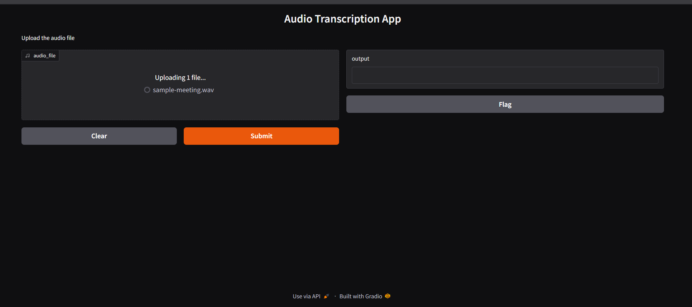
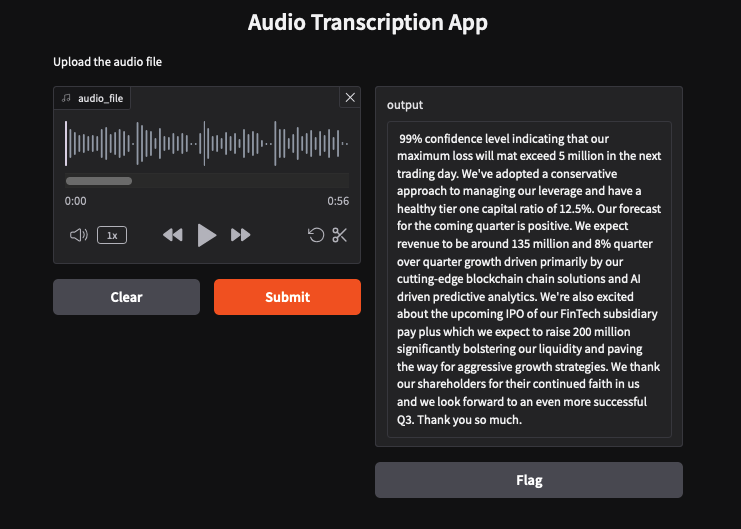
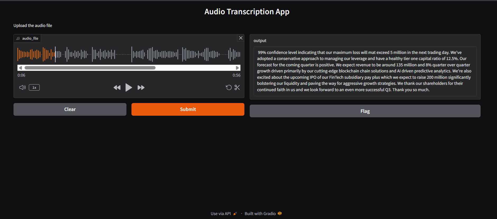

# Audio Transcription App



---



---



---
---

## Create venv

## Install Required Libraries
```bash
sudo apt update
sudo apt install ffmpeg -y
```

### Create `simple_speech2text.py` and Run
```bash
python3 simple_speech2text.py
```

### Update `simple_speech2text.py` and Re-run
```bash
python3 simple_speech2text.py
```

### Create `speech2text_app.py` and Run
```bash
python3 speech2text_app.py
```
